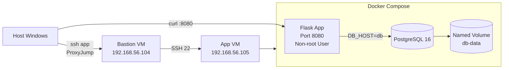
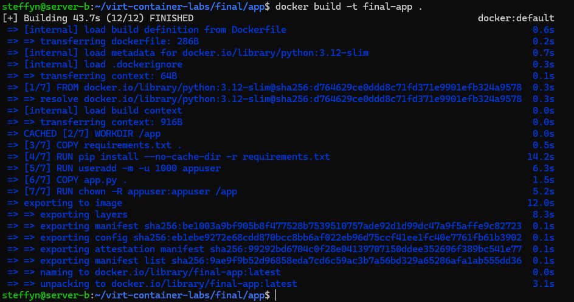
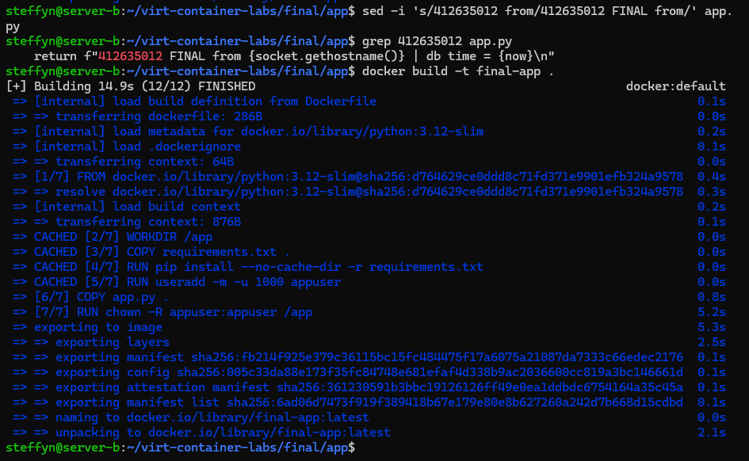
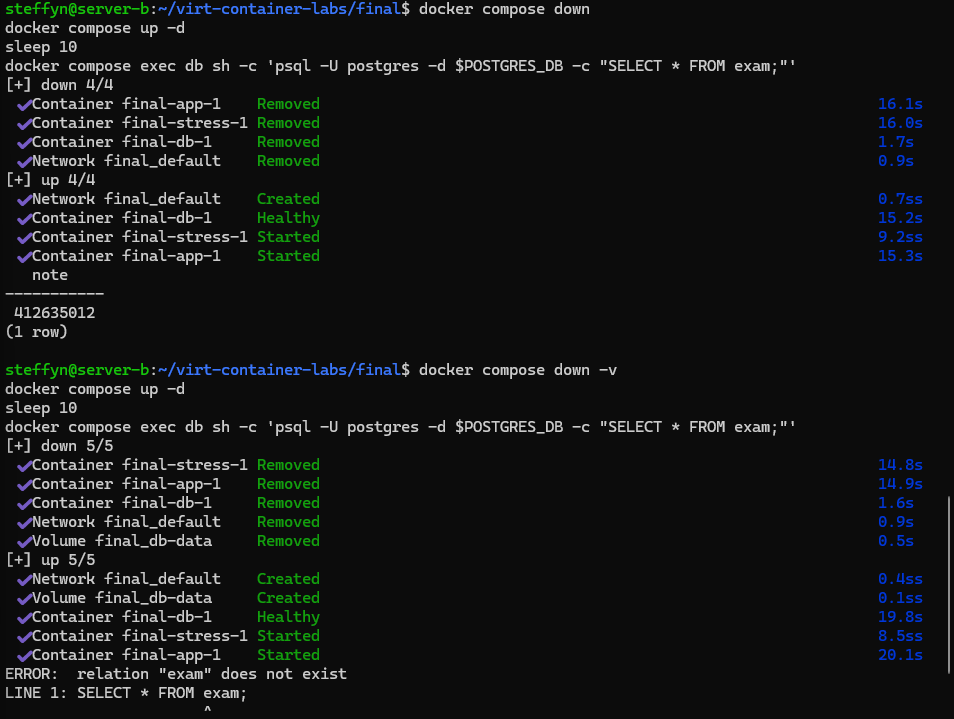
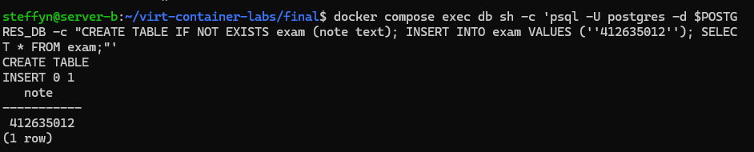

 期末實作 — <412635012> <劉管亮>

## 1. 架構總覽


## 2. Part A：底座與基準點
<ssh 證據 + 版本 + snapshot>


Host bastion
    HostName 192.168.56.104
    User steffyn

Host app
    HostName 192.168.56.105
    User steffyn
    ProxyJump bastion

## 3. Part B：Dockerfile 與快取
<Dockerfile + 兩次 build 對照>
### Dockerfile

```dockerfile
FROM python:3.12-slim

WORKDIR /app

COPY requirements.txt .
RUN pip install --no-cache-dir -r requirements.txt

RUN useradd -m -u 1000 appuser

COPY app.py .

RUN chown -R appuser:appuser /app

USER appuser

EXPOSE 8080

CMD ["python", "app.py"]
```

### Build cache evidence

First build:



Second build after changing one line in `app.py`:



### 為什麼聽 8080 不聽 80？
This container creates a non-root user called appuser and runs the application using that user. In Linux, ports below 1024 are protected ports and usually require root permission. Since a non-root user cannot use port 80 directly, the application listens on port 8080 instead. This improves security and follows the principle of giving only the permissions that are needed.

## 4. Part C：Compose 與資料持久化
<compose.yaml 重點 + 三段對照>

### compose.yaml 重點

```yaml
services:
  db:
    image: postgres:16
    volumes:
      - db-data:/var/lib/postgresql/data
    healthcheck:
      test: ["CMD-SHELL", "pg_isready -U postgres -d $${POSTGRES_DB}"]

  app:
    build: ./app
    ports:
      - "8080:8080"
    depends_on:
      db:
        condition: service_healthy

volumes:
  db-data:
```

The PostgreSQL service stores data in the named volume `db-data`. The app service depends on the database health check and only starts after the database becomes healthy.





### 三段對照

| 階段 | 指令 | SELECT * FROM exam 結果 |
|------|------|-------------------------|
| 砍容器重建 | `docker compose down && docker compose up -d` | 資料仍存在 |
| 連 volume 一起砍 | `docker compose down -v && docker compose up -d` | 資料消失（relation "exam" does not exist） |
| 重寫 | 再次執行 `INSERT INTO exam VALUES ('412635012');` | 資料重新出現 |

### down vs down -v
docker compose down only removes containers and networks. It does not remove named volumes, so the PostgreSQL data is still stored in the db-data volume.

docker compose down -v removes containers, networks, and named volumes. Because the db-data volume is deleted, all database data is lost.

The named volume is managed by Docker. However, whether it is deleted depends on the command used by the user. A normal docker compose down keeps the volume, while docker compose down -v removes it.

## 5. Part D：生產化加固
<權限驗證輸出 + cgroup 讀值對照表>


### yaml 的值怎麼對回 cgroup 檔案？
In compose.yaml, I wrote:

mem_limit: 256m
cpus: "0.5"
pids_limit: 200

The cgroup value memory.max shows 268435456 because 256 MiB = 256 × 1024 × 1024 = 268435456 bytes.

The cgroup value cpu.max shows 50000 100000. In cgroup v2, cpu.max uses the format "quota period". This means the container can use 50000 microseconds of CPU time in every 100000 microseconds period, which equals 50% CPU, the same as cpus: "0.5".

The cgroup value pids.max shows 200, which directly matches pids_limit: 200 in compose.yaml.


## 6. Part E：故障演練

### 故障 1：<F1–F4 擇一> F1
- 注入方式：
docker compose stop db

- 故障中：
After stopping the database, the app container was still running, but it could no longer connect to the database. Because of this, the health check started to fail. After about 30 seconds, docker compose ps showed the app status as unhealthy, and curl http://localhost:8080/healthz returned HTTP 503.

- 回復後：
docker compose start db. After restarting the database, the app was able to connect to the database again. The health check became successful, the status returned to healthy, and /healthz returned HTTP 200.

- 診斷推論：
This failure shows that an unhealthy container is not the same as a stopped container. The app container was still running, but the database service it depended on was unavailable, causing the health check to fail.

| Before | During | After |
|---------|---------|---------|
|  |  |  |

### 故障 2：<另一個> F2
-- 注入方式：
docker compose stop app

- 故障前：
The app and database were running normally. Running curl http://localhost:8080/ returned my student ID and the database time.

- 故障中：
After stopping the app container, there was no service listening on port 8080. Running curl http://localhost:8080/ returned a connection refused error.

- 回復後：
docker compose start app. After the container started again, the service returned to normal. Running curl http://localhost:8080/ returned a normal response.

- 診斷推論：
This failure happened at the container layer. Since the app container was stopped, a TCP connection could not be established, so a connection refused error was returned.

| Before | During | After |
|---------|---------|---------|
|  |  |  |

### 三症狀分層表（必答）
| 症狀 | 最可能的層 | 第一條驗證命令 |
| ---- | ---------- | -------------- |
| timeout | 網路層（Network） | ping 192.168.56.105 |
| connection refused | 容器／服務層（Container / Service） | docker compose ps |
| HTTP 503 | 應用程式層（Application）  | curl http://localhost:8080/healthz |

## 7. 反思（200 字）
這學期從 VM 做到 production-ready 容器，「隔離」這個概念在 VM、namespace、
cgroup、權限階梯四個地方各出現一次——它們在防的東西一樣嗎？

This semester, I learned that isolation is used in different ways in VMs, namespaces, cgroups, and permissions. Even though they all provide protection, they do not protect the same thing.

A VM provides isolation by running a separate operating system. If one VM has a problem, it usually will not affect another VM. This makes VMs very secure but they use more resources.

Namespaces are used in containers. They make each container think it has its own processes, network, and files. This helps containers run independently even when sharing the same Linux kernel.

Cgroups are used to control resources. For example, they can limit how much CPU and memory a container can use. This prevents one container from using all system resources and affecting other services.

Permissions provide another layer of protection. Running applications as a non-root user and removing unnecessary privileges reduces security risks if the application is attacked.

In conclusion, these four types of isolation have different purposes. VMs isolate operating systems, namespaces isolate environments, cgroups isolate resources, and permissions isolate privileges. By working together, they make containerized applications more secure and stable.

## 8. Bonus（選做）
